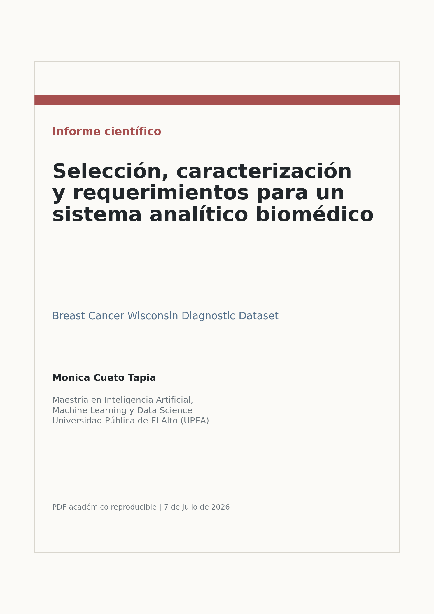
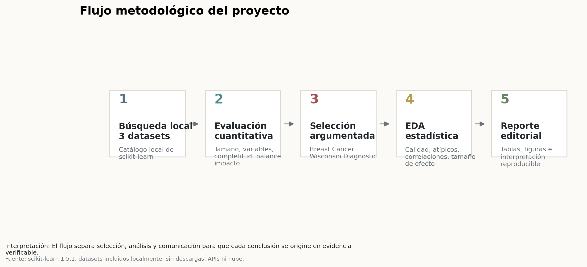
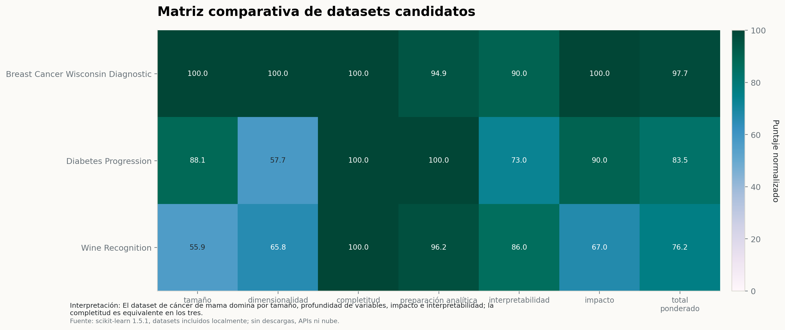
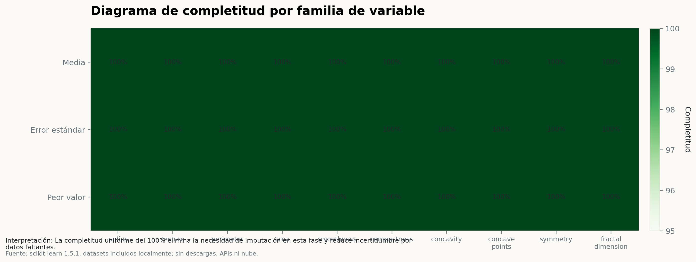
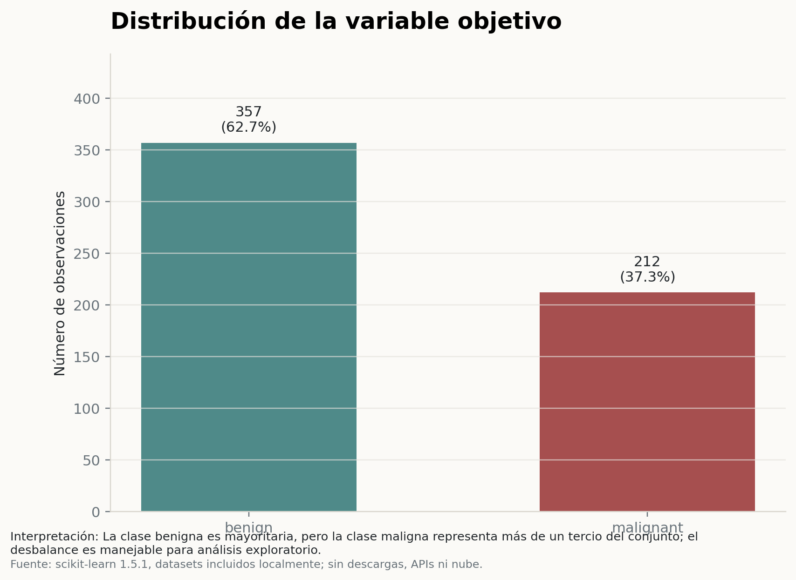
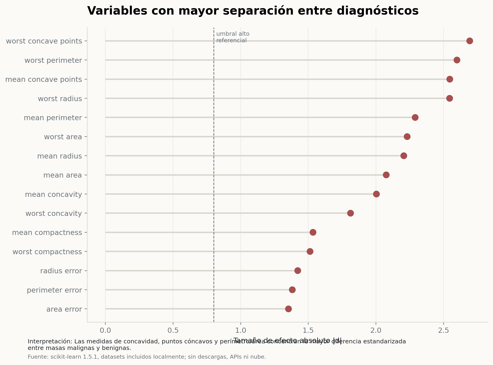
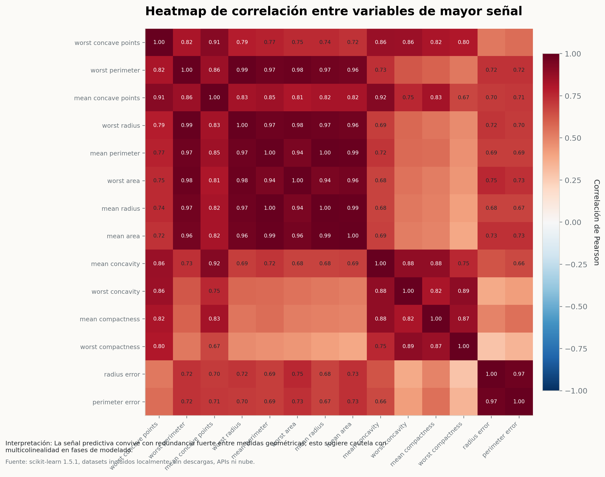

# Data Science Requirements: Breast Cancer Diagnostic Dataset

Reproducible data science requirements project for dataset selection, exploratory characterization and analytical-system requirements using the Breast Cancer Wisconsin Diagnostic dataset.


<p align="center">
  
</p>

<p align="center">
  <a href="https://monicact.github.io/data-science-requirements-breast-cancer/"></a>
  <a href="https://github.com/MonicaCT/data-science-requirements-breast-cancer/blob/main/report/final_report.html"></a>
  <a href="https://monicact.github.io/data-science-requirements-breast-cancer/#figures"></a>
  <a href="https://monicact.github.io/data-science-requirements-breast-cancer/#tables"></a>
  <a href="https://monicact.github.io/data-science-requirements-breast-cancer/#methodology"></a>
  <a href="https://github.com/MonicaCT/data-science-requirements-breast-cancer"></a>
  <a href="https://monicact.github.io/"></a>
</p>

## Project Objective

This repository documents the early phases of a data science project: dataset search and comparison, quantitative selection, data-quality assessment, exploratory statistical analysis, and functional and non-functional requirements for a biomedical analytical system.

No predictive model is trained in the current scope. The project is intentionally limited to selection, contextualization, descriptive analysis and requirements definition.

## Selected Dataset

**Breast Cancer Wisconsin Diagnostic**

- Source: datasets available locally through scikit-learn.
- Observations: 569.
- Predictive variables: 30.
- Target variable: benign or malignant diagnosis.
- Missing values: 0%.
- Duplicate rows: 0.
- Weighted selection score: 97.7355 out of 100.

The dataset was selected for impact, interpretability, completeness, sample size and dimensional richness. The existing statistical outputs identify strong class separation in morphological variables such as `worst concave points`, `worst perimeter`, `mean concave points` and `worst radius`.

## Portfolio Classification

Primary Lab:

- **Data Science Lab** - dataset selection, exploratory data analysis, analytical requirements and reproducible Python workflow.

Secondary Labs:

- **Research Methods Lab** - documented methodology, data-quality audit, effect sizes, reproducibility manifest and traceable evidence.
- **Open Science Lab** - public repository, local reproducibility, transparent tables and final report artifacts.

## Main Outputs

| Project flow | Dataset comparison |
|---|---|
|  |  |

| Missingness map | Target distribution |
|---|---|
|  |  |

| Effect sizes | Correlation heatmap |
|---|---|
|  |  |

## Methodology

The project follows a constrained, reproducible academic workflow:

1. Search three candidate datasets available locally in scikit-learn.
2. Compare candidates using normalized criteria: sample size, dimensionality, completeness, analytical readiness, interpretability and impact.
3. Select the highest-scoring dataset.
4. Build a complete variable dictionary.
5. Audit data quality: missingness, duplicates, class balance and IQR outliers.
6. Produce exploratory statistics, correlations and class effect sizes.
7. Define functional and non-functional requirements.
8. Generate final tables, figures and an editorial HTML/PDF report.

The workflow does not use external AI models, APIs, cloud services or dataset downloads.

## Requirements Deliverables

- [Functional requirements](tables/functional_requirements.csv)
- [Non-functional requirements](tables/nonfunctional_requirements.csv)
- [Data dictionary](tables/data_dictionary.csv)
- [Dataset comparison](tables/dataset_comparison.csv)
- [Data quality summary](tables/data_quality_summary.csv)
- [Variable effect sizes](tables/variable_effect_sizes.csv)

## Final Report

- [Final HTML report](report/final_report.html)
- [Final PDF report](report/final_report.pdf)
- [Reproducibility manifest](report/reproducibility_manifest.json)

The PDF includes professional cover, table of contents, figure index, table index, numbered pages, headers, footers, numbered figures and tables, cross-references, conclusions, bibliography and appendices. It was composed from existing final artifacts without recalculating statistics or regenerating analytical charts.

## Repository Structure

```text
data/      selected local dataset sample
figures/   final visual outputs
report/    final HTML/PDF report and reproducibility manifest
src/       reproducible project and report builders
tables/    generated data-quality, dictionary and requirements tables
```

## Reproducibility

Install permitted dependencies:

```bash
pip install -r requirements.txt
```

Run from the repository root:

```bash
python src/build_project.py
```

The script regenerates the final artifacts in `data/`, `tables/`, `figures/` and `report/`. This portfolio harmonization did not run the pipeline, rerun analysis or regenerate outputs.

To regenerate only the PDF from existing final outputs:

```bash
python src/build_pdf_report.py
```

PDF generation requires a local XeLaTeX/TinyTeX installation. It does not require internet or dataset downloads.

## Limitations

This is an academic and methodological project, not a clinical decision tool. Outputs must not be interpreted as medical advice, patient-level diagnosis or individual recommendation. Later modelling phases should use stratified splits, feature-redundancy controls and appropriate validation before any predictive interpretation.

## Citation

Citation metadata are available in [CITATION.cff](CITATION.cff).

## Author

**Monica Cueto Tapia**<br>
GitHub: [MonicaCT](https://github.com/MonicaCT)

## Portfolio Navigation

- [MonicaCT GitHub profile](https://github.com/MonicaCT)
- [Economic Complexity and Structural Transformation in Latin America](https://github.com/MonicaCT/economic-complexity-structural-transformation-lac)
- [Inclusive Credit Risk Analytics - Bolivia](https://github.com/MonicaCT/InclusiveCreditRiskAnalytics-Bolivia)
- [Poverty, Informality and Social Protection in Latin America](https://github.com/MonicaCT/poverty-informality-social-protection-lac)
- [Financial Development, Stability and Growth in Latin America](https://github.com/MonicaCT/latin-america-financial-development-lab)
- [Structural Vulnerability in Latin America and the Caribbean](https://github.com/MonicaCT/structural-vulnerability-lac-research)
- [Rural Bolivia Housing Analytics](https://github.com/MonicaCT/rural-bolivia-housing-analytics)